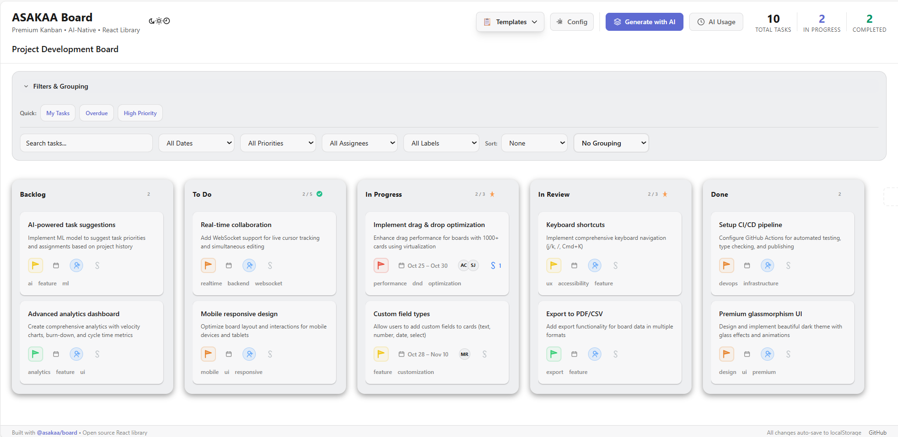
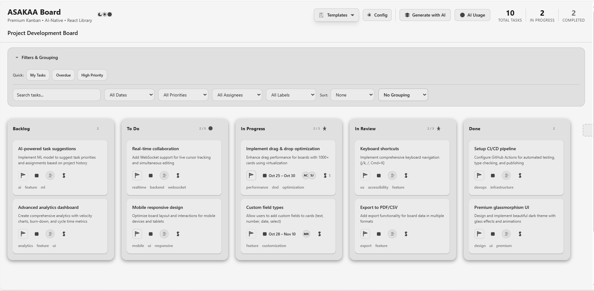

<div align="center">

# 🎯 ASAKAA

### Production-Ready React Kanban Board Component

*Modern, TypeScript-first Kanban board for React applications*

[](./LICENSE)
[](https://www.typescriptlang.org/)
[](https://reactjs.org/)
[](https://github.com/Yesid8/asakaa)
[](./CONTRIBUTING.md)
[](https://github.com/Yesid8/asakaa/stargazers)

[🚀 Live Demo](https://asakaa-kanban.vercel.app/) • [Documentation](#installation) • [Examples](#usage) • [Contributing](./CONTRIBUTING.md)

</div>

---

## 🚀 Why ASAKAA?

**Stop wrestling with low-level drag-and-drop libraries.** ASAKAA gives you a complete, production-ready Kanban board in minutes, not weeks.

### ✨ All-in-One Solution
- ✅ **Drag & Drop** - Smooth 60fps animations powered by @dnd-kit
- ✅ **3 Beautiful Themes** - Dark, Light, and Neutral (Zen mode)
- ✅ **Advanced Filtering** - Search, filter by assignee, labels, priority, dates
- ✅ **Virtual Scrolling** - Handle 10,000+ cards without performance issues
- ✅ **TypeScript First** - Complete type definitions out of the box
- ✅ **Keyboard Shortcuts** - Power users rejoice (Cmd+K, undo/redo, bulk ops)
- ✅ **Export/Import** - JSON, CSV, PDF exports built-in
- ✅ **Plugin System** - 15+ lifecycle hooks for customization
- ✅ **Accessibility** - WCAG AAA compliant (7:1 contrast ratios)

### 📦 vs. Competitors

| Feature | ASAKAA | react-beautiful-dnd | @dnd-kit/sortable | react-dnd |
|---------|--------|---------------------|-------------------|-----------|
| **Kanban UI included** | ✅ Built-in | ❌ DIY | ❌ DIY | ❌ DIY |
| **Themes** | ✅ 3 themes | ❌ None | ❌ None | ❌ None |
| **Filtering** | ✅ Advanced | ❌ None | ❌ None | ❌ None |
| **TypeScript** | ✅ Full | ⚠️ Partial | ✅ Full | ✅ Full |
| **Maintained** | ✅ Active | ❌ Deprecated | ✅ Active | ✅ Active |
| **Bundle size** | 198 KB | ~40 KB* | ~20 KB* | ~45 KB* |
| **Learning curve** | 5 min | 2-3 days | 2-3 days | 3-4 days |

*\*Without UI, theming, filtering, virtualization, or keyboard shortcuts*

**ASAKAA = Everything you need, nothing you don't.**

---

## 📸 See It In Action

> **Note**: Demo GIF coming soon! For now, run the demo locally:
> ```bash
> git clone https://github.com/Yesid8/asakaa.git
> cd asakaa/packages/board/examples/demo
> npm install && npm run dev
> # Open http://localhost:3000
> ```

### Three Themes, Instant Switching

## Three Beautiful Themes

ASAKAA v0.6.0 introduces a Enhanced design system with three carefully crafted themes:

### Dark Theme (Enhanced)
> Speed, efficiency, focus - optimized for developer productivity


### Light Theme (Standard)
> Clarity, legibility, professionalism - WCAG AAA compliant



### Neutral Theme (Zen Mode)
> Minimalism, calm technology, maximum concentration - pure monochrome



## ✨ What's New in v0.6.0

**Enhanced Design Refinements:**
- Three polished themes: Dark (Enhanced), Light (Standard), Neutral (Zen)
- Pure text labels without background noise
- Simplified column indicators
- 100% grayscale enforcement in Neutral theme
- SVG icons in theme switcher for better UX
- Enhanced visual hierarchy: content is king, metadata is secondary

**Theme Philosophy:**
- **Dark**: Enhanced for speed and focus
- **Light**: High contrast (7:1) for accessibility
- **Neutral**: Absolute monochrome for distraction-free work

## Installation

```bash
npm install @asakaa/board
```

Or with other package managers:

```bash
yarn add @asakaa/board
pnpm add @asakaa/board
```

## Usage

```tsx
import { KanbanBoard, ThemeProvider } from '@asakaa/board'
import '@asakaa/board/styles.css'

function App() {
  return (
    <ThemeProvider defaultTheme="dark">
      <KanbanBoard
        columns={[
          { id: 'todo', title: 'To Do', cards: [] },
          { id: 'in-progress', title: 'In Progress', cards: [] },
          { id: 'done', title: 'Done', cards: [] }
        ]}
      />
    </ThemeProvider>
  )
}
```

### Theme Switching

```tsx
import { ThemeSwitcher, useTheme } from '@asakaa/board'

function MyApp() {
  const { theme, setTheme } = useTheme()

  return (
    <div>
      {/* Quick switcher component */}
      <ThemeSwitcher />

      {/* Or programmatic control */}
      <button onClick={() => setTheme('neutral')}>
        Zen Mode
      </button>
    </div>
  )
}
```

## Technical Specifications

### @asakaa/board (v0.6.0)

**Core Features:**
- Drag-and-drop functionality via @dnd-kit
- Virtual scrolling for lists with 1000+ items (@tanstack/react-virtual)
- TypeScript-first architecture with complete type definitions
- Plugin system with 15+ lifecycle hooks
- Command palette with keyboard shortcuts (Cmd/Ctrl+K)
- Undo/Redo with command pattern implementation
- Bulk operations API
- Real-time performance monitoring
- **NEW**: Three professionally designed themes with instant switching
- **NEW**: Enhanced design refinements

**Architecture:**
- State management: Jotai atoms
- Animation: Framer Motion
- Styling: CSS variables with Design System v2.0
- Build: tsup (ESM + CJS)
- Testing: Vitest with 75% coverage

**Bundle Size:**
- ESM: 150.99 KB
- CJS: 163.44 KB
- CSS: 41.05 KB
- Tree-shakeable

**Performance:**
- Virtual scrolling handles 10,000+ cards
- 60fps drag-and-drop animations
- Debounced search with 300ms delay
- Optimized re-renders with React.memo

**Browser Support:**
- Chrome/Edge 90+
- Firefox 88+
- Safari 14+

## Project Structure

```
asakaa/
├── packages/
│   └── board/              # @asakaa/board package
│       ├── src/
│       │   ├── components/ # React components
│       │   ├── hooks/      # Custom React hooks
│       │   ├── stores/     # Jotai state stores
│       │   ├── types/      # TypeScript definitions
│       │   ├── utils/      # Utility functions
│       │   ├── theme/      # Theme system (v0.6.0)
│       │   └── styles/     # CSS with Design System v2.0
│       ├── examples/       # Demo applications
│       └── dist/           # Build output
└── pnpm-workspace.yaml     # Monorepo configuration
```

## Development

This monorepo uses pnpm workspaces.

**Setup:**
```bash
# Install dependencies
pnpm install

# Build packages
pnpm run build

# Run tests
pnpm test

# Type checking
pnpm run typecheck
```

**Development Workflow:**
```bash
# Start dev server for demo
cd packages/board/examples/demo
npm run dev

# Run tests in watch mode
pnpm run test:watch

# Generate API documentation
pnpm run docs
```

## API Reference

### Board Component

```tsx
interface KanbanBoardProps {
  columns: Column[]
  onUpdate?: (columns: Column[]) => void
  config?: BoardConfig
  plugins?: Plugin[]
}
```

### Theme System (v0.6.0)

```tsx
import { ThemeProvider, useTheme, ThemeSwitcher, ThemeModal } from '@asakaa/board'

// Theme Provider
<ThemeProvider defaultTheme="dark">
  <App />
</ThemeProvider>

// useTheme hook
const { theme, setTheme, themes } = useTheme()

// Available themes
type ThemeName = 'dark' | 'light' | 'neutral'
```

### Plugin System

```tsx
interface Plugin {
  name: string
  version: string
  hooks: {
    onCardCreate?: (card: Card) => void
    onCardUpdate?: (card: Card) => void
    onCardDelete?: (cardId: string) => void
    // ... 12 more hooks
  }
}
```

### Hook Examples

```tsx
import { useBoard, useSelection, useUndo } from '@asakaa/board'

// Access board state
const { data, updateCard } = useBoard()

// Selection state
const { selectedCards, selectCard } = useSelection()

// Undo/Redo
const { undo, redo, canUndo, canRedo } = useUndo()
```

## Design System v2.0

The board component uses a CSS variables-based design system:

```css
/* Typography Scale */
--font-2xs: 10px
--font-xs: 12px
--font-sm: 14px
--font-base: 16px
--font-lg: 20px
--font-xl: 24px
--font-2xl: 32px
--font-3xl: 48px

/* Spacing Scale (4px grid) */
--space-1: 4px
--space-2: 8px
--space-3: 12px
--space-4: 16px
/* ... up to --space-16: 64px */

/* Opacity Scale */
--opacity-subtle: 0.05
--opacity-faint: 0.10
--opacity-light: 0.20
--opacity-medium: 0.40
--opacity-strong: 0.60
--opacity-opaque: 0.80
--opacity-full: 1.0

/* Theme Colors (v0.6.0) */
--color-bg-primary: var(--theme-bg-primary)
--color-bg-secondary: var(--theme-bg-secondary)
--color-text-primary: var(--theme-text-primary)
--color-text-secondary: var(--theme-text-secondary)
--color-text-tertiary: var(--theme-text-tertiary)
```

## Testing

```bash
# Run all tests
pnpm test

# Coverage report
pnpm run test:coverage

# UI mode
pnpm run test:ui
```

Current test coverage: 75%

## Building

```bash
# Build all packages
pnpm run build

# Build specific package
cd packages/board
pnpm run build
```

Output formats:
- ESM: `dist/index.js`
- CJS: `dist/index.cjs`
- Types: `dist/index.d.ts` + `dist/index.d.cts`
- CSS: `dist/styles.css`

## Screenshots Guide

To update screenshots for this README:

1. **Take screenshots** of each theme at `http://localhost:3000`:
   - Dark theme → `theme-dark.png`
   - Light theme → `theme-light.png`
   - Neutral theme → `theme-neutral.png`

2. **Save to** `.github/screenshots/`

3. **Specifications**:
   - Format: PNG
   - Width: 1600px (ideal)
   - Quality: High resolution, < 500KB each
   - Content: Show 3+ columns with cards containing labels

4. **Commit and push**:
```bash
git add .github/screenshots/
git commit -m "docs: Update theme screenshots for v0.6.0"
git push
```

## Changelog

See [CHANGELOG.md](./CHANGELOG.md) for version history and release notes.

## License

Business Source License 1.1 - See [LICENSE](./LICENSE) for details.

**TLDR**: Free for non-production use (development, testing, evaluation). Converts to Apache 2.0 on 2027-10-12.

## Packages

| Package | Version | Status |
|---------|---------|--------|
| [@asakaa/board](./packages/board) | 0.6.0 | Production |
| @asakaa/todo | - | Planned |
| @asakaa/gantt | - | Planned |
| @asakaa/calendar | - | Planned |

---

Built with TypeScript, React, and love for clean interfaces.
