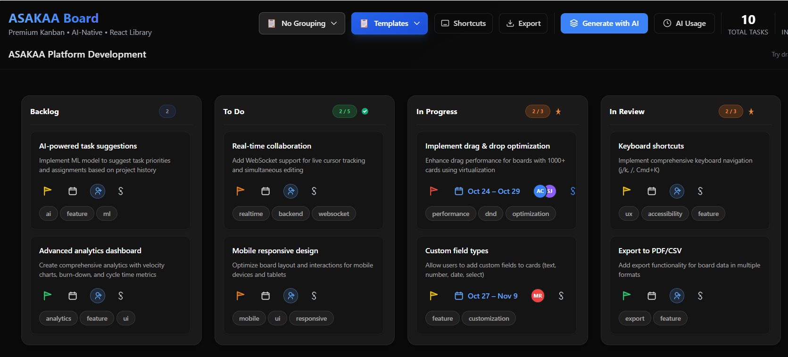

# ASAKAA

Project management components for React applications.

[](./LICENSE)
[](https://www.typescriptlang.org/)
[](https://reactjs.org/)

## Overview

ASAKAA is a monorepo containing production-ready React components for project management interfaces. The suite currently includes a Kanban board component with planned expansion to todo lists, Gantt charts, and calendar views.

## Interface



*Modern Kanban board with drag-and-drop, virtual scrolling, and Design System v2.0*

## Installation

```bash
npm install @asakaa/board
```

Or with other package managers:

```bash
yarn add @asakaa/board
pnpm add @asakaa/board
```

## Usage

```tsx
import { Board } from '@asakaa/board'
import '@asakaa/board/styles.css'

function App() {
  const initialData = {
    columns: [
      { id: 'todo', title: 'To Do', cards: [] },
      { id: 'in-progress', title: 'In Progress', cards: [] },
      { id: 'done', title: 'Done', cards: [] }
    ]
  }

  return <Board initialData={initialData} />
}
```

## Technical Specifications

### @asakaa/board (v0.3.1)

**Core Features:**
- Drag-and-drop functionality via @dnd-kit
- Virtual scrolling for lists with 1000+ items (@tanstack/react-virtual)
- TypeScript-first architecture with complete type definitions
- Plugin system with 15+ lifecycle hooks
- Command palette with keyboard shortcuts
- Undo/Redo with command pattern implementation
- Bulk operations API
- Real-time performance monitoring

**Architecture:**
- State management: Jotai atoms
- Animation: Framer Motion
- Styling: CSS variables with Design System v2.0
- Build: tsup (ESM + CJS)
- Testing: Vitest with 75% coverage

**Bundle Size:**
- ESM: 40.43 KB minified
- CJS: 42.67 KB minified
- CSS: 30 KB minified

**Performance:**
- Virtual scrolling handles 10,000+ cards
- 60fps drag-and-drop animations
- Debounced search with 300ms delay
- Optimized re-renders with React.memo

**Browser Support:**
- Chrome/Edge 90+
- Firefox 88+
- Safari 14+

## Project Structure

```
asakaa/
├── packages/
│   └── board/              # @asakaa/board package
│       ├── src/
│       │   ├── components/ # React components
│       │   ├── hooks/      # Custom React hooks
│       │   ├── stores/     # Jotai state stores
│       │   ├── types/      # TypeScript definitions
│       │   ├── utils/      # Utility functions
│       │   └── styles/     # CSS with Design System v2.0
│       ├── examples/       # Demo applications
│       └── dist/           # Build output
└── pnpm-workspace.yaml     # Monorepo configuration
```

## Development

This monorepo uses pnpm workspaces.

**Setup:**
```bash
# Install dependencies
pnpm install

# Build packages
pnpm run build

# Run tests
pnpm test

# Type checking
pnpm run typecheck
```

**Development Workflow:**
```bash
# Start dev server for demo
cd packages/board/examples/demo
npm run dev

# Run tests in watch mode
pnpm run test:watch

# Generate API documentation
pnpm run docs
```

## API Reference

### Board Component

```tsx
interface BoardProps {
  initialData: BoardData
  config?: BoardConfig
  plugins?: Plugin[]
  onUpdate?: (data: BoardData) => void
}
```

### Plugin System

```tsx
interface Plugin {
  name: string
  version: string
  hooks: {
    onCardCreate?: (card: Card) => void
    onCardUpdate?: (card: Card) => void
    onCardDelete?: (cardId: string) => void
    // ... 12 more hooks
  }
}
```

### Hook Examples

```tsx
import { useBoard, useSelection, useUndo } from '@asakaa/board'

// Access board state
const { data, updateCard } = useBoard()

// Selection state
const { selectedCards, selectCard } = useSelection()

// Undo/Redo
const { undo, redo, canUndo, canRedo } = useUndo()
```

## Design System v2.0

The board component uses a CSS variables-based design system:

```css
/* Typography Scale */
--font-2xs: 10px
--font-xs: 12px
--font-sm: 14px
--font-base: 16px
--font-lg: 20px
--font-xl: 24px
--font-2xl: 32px
--font-3xl: 48px

/* Spacing Scale (4px grid) */
--space-1: 4px
--space-2: 8px
--space-3: 12px
--space-4: 16px
/* ... up to --space-16: 64px */

/* Opacity Scale */
--opacity-subtle: 0.05
--opacity-faint: 0.10
--opacity-light: 0.20
--opacity-medium: 0.40
--opacity-strong: 0.60
--opacity-opaque: 0.80
--opacity-full: 1.0
```

## Testing

```bash
# Run all tests
pnpm test

# Coverage report
pnpm run test:coverage

# UI mode
pnpm run test:ui
```

Current test coverage: 75%

## Building

```bash
# Build all packages
pnpm run build

# Build specific package
cd packages/board
pnpm run build
```

Output formats:
- ESM: `dist/index.js`
- CJS: `dist/index.cjs`
- Types: `dist/index.d.ts`
- CSS: `dist/styles.css`

## Adding Screenshots

To add screenshots to this README:

1. Create the screenshots directory:
```bash
mkdir -p .github/screenshots
```

2. Take a screenshot of the interface and save it as PNG or JPG

3. Add the image file to `.github/screenshots/`:
```bash
# Example: board-interface.png
.github/screenshots/board-interface.png
```

4. Reference in README.md:
```markdown

```

5. Commit and push:
```bash
git add .github/screenshots/
git commit -m "docs: Add interface screenshots"
git push
```

**Recommended screenshot specifications:**
- Format: PNG for UI screenshots
- Width: 1280-1920px (ideal: 1600px)
- Height: auto (maintain aspect ratio)
- File size: < 500KB (use compression if needed)

## Changelog

See [CHANGELOG.md](./CHANGELOG.md) for version history and release notes.

## License

Business Source License 1.1 - See [LICENSE](./LICENSE) for details.

## Packages

| Package | Version | Status |
|---------|---------|--------|
| [@asakaa/board](./packages/board) | 0.3.1 | Production |
| @asakaa/todo | - | Planned |
| @asakaa/gantt | - | Planned |
| @asakaa/calendar | - | Planned |
